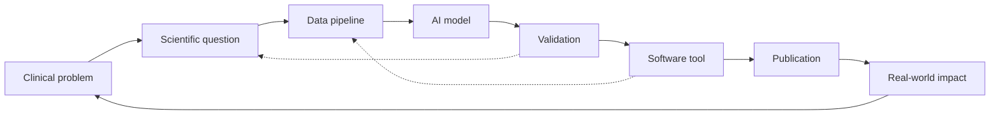

# R&D in biomedical AI

> In biomedical AI, R&D means using **scientific research, clinical knowledge, data, and engineering** to build AI systems that improve medicine or biology.

This section is the field-specific version of the rest of the hub. The principles do not change. The examples, the artifacts, and the constraints do.

## What's in this section

- **[Research questions](research-questions.md)** — the questions biomedical AI R&D is actually trying to answer.
- **[Development outputs](development-outputs.md)** — the artifacts biomedical AI R&D actually produces.
- **[R&D outputs](rd-outputs.md)** — what counts as a finished R&D contribution in biomedical AI.

## Why biomedical AI is different

Biomedical AI is not just generic ML applied to medical data. Several specific things change:

- **The data is heterogeneous.** Imaging, EEG, genomics, clinical notes, lab values, wearables. Each has its own format, units, and noise.
- **The labels are scarce, noisy, and expensive.** Gold-standard labels often require surgery, pathology, or long follow-up.
- **The distribution shifts constantly.** Scanners, protocols, populations, and clinical practice change year over year.
- **The user has agency.** A clinician decides whether to act on a recommendation. The system has to support, not replace, that judgment.
- **The deployment surface is regulated.** Hospitals, devices, and software-as-a-medical-device pathways constrain what can ship.
- **Failure can hurt people.** A confidently wrong recommendation has consequences that other ML applications do not face.

Every section of this hub — beginner through PhD — has to be re-read with those constraints in mind when you do biomedical AI specifically.

## The R&D loop in biomedical AI

A biomedical AI researcher at PhD level can move through this loop end-to-end: clinical problem → scientific question → data pipeline → AI model → validation → software tool → publication → real-world impact.

Almost no other field combines that many layers in a single career arc. That is what makes it hard, and what makes it valuable when done well.

## Where to next

- [Research questions](research-questions.md) — what biomedical AI R&D actually asks.
- [Case study — hippocampal sclerosis](../case-studies/hippocampal-sclerosis.md) — the worked example seen at all four levels.
