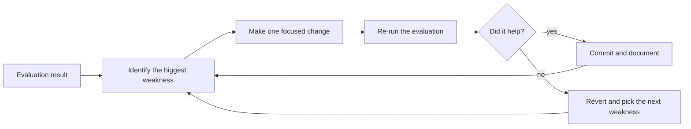

# 7. Improve

> R&D is **iterative.** You build, test, find weaknesses, and improve.

If step 6 was done honestly, you now have a list of things that did not work. Step 7 is where you turn that list into a prioritised, finite set of changes — and resist the urge to redo everything.

## The improvement loop

Two rules:

1. **One change at a time.** If you change three things at once and the metric goes up, you do not know which change helped.
2. **Always be able to revert.** Use git branches or tags so you can roll back without losing previous good states.

## How to pick the next thing to fix

Sort weaknesses by **impact × tractability**:

- **High impact, easy fix** — do first.
- **High impact, hard fix** — schedule.
- **Low impact, easy fix** — batch.
- **Low impact, hard fix** — ignore.

If you cannot estimate impact or tractability for an item, your evaluation step did not give you enough information. Go back to [6. Test and evaluate](test-evaluate.md) and gather it.

## Common improvement levers in biomedical AI

- **More or better data.** Often the single biggest lever. Carefully cleaning twenty extra subjects often beats months of model tuning.
- **Better preprocessing.** Bias-field correction, motion handling, registration quality. The unglamorous parts often dominate.
- **Better baseline comparison.** A stronger baseline may show that your gains were illusory — that is also "improvement" in the sense that it improves your understanding.
- **Better evaluation.** Sometimes the *measurement* improves, not the model. Realising your splits leaked is a real improvement.
- **Architecture / model.** Usually overrated as a lever, but real in some cases.
- **Calibration and thresholds.** Often the difference between "interesting" and "clinically usable."

## When to stop improving

You stop when:

- You have hit the question's threshold (the success criterion you wrote in step 3).
- Or you have hit a plateau and no remaining item on the list is high-impact-low-cost.
- Or you have run out of time and need to ship what you have.

A clear stop is a sign of a healthy project. Endless improvement loops are usually projects that lost track of their question.

## Track what you tried

Maintain a simple log: date, change, primary metric before, primary metric after, notes.

That log is gold. It tells you which directions are dead, which look promising, and what you can write up honestly. It also keeps you from re-running the same failed experiment three months later.

## Document as you go

Every change that survives gets a short note in the codebase:

- Why you made the change.
- What it cost.
- What it gained.
- What it broke.

These notes go straight into the final methods section. Writing them as you go is much cheaper than reconstructing them at the end.

## Common traps

- **Chasing the metric.** If you find yourself making changes whose only justification is "it went up," you are overfitting to your test set. Stop and re-split.
- **Rewriting from scratch.** Almost never the right answer. Refactor incrementally.
- **Ignoring negative results.** A change that does not help is still information; record it.
- **Not knowing when to stop.** Set a target before you start and respect it.

## Where to next

You have iterated and improved (or learned that you cannot). Now tell the world: [8. Communicate results](communicate.md).
