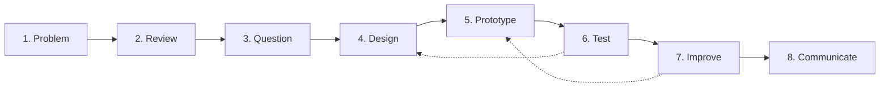

# Intermediate — the R&D process

> At the intermediate level, R&D becomes a **structured process.**

This section names the eight steps that every R&D project — small or large, biomedical or otherwise — goes through. You have probably done several of them informally as a beginner. Naming them is what lets you do bigger projects without losing your way.

## The eight steps

1. **[Identify a problem](identify-problem.md)** — start with a real need.
2. **[Review existing knowledge](review-knowledge.md)** — figure out what is already done.
3. **[Form a research question](research-question.md)** — convert the need into something answerable.
4. **[Design a method](design-method.md)** — decide how you will answer it.
5. **[Build a prototype](build-prototype.md)** — make a working version of the idea.
6. **[Test and evaluate](test-evaluate.md)** — check whether it actually works.
7. **[Improve](improve.md)** — iterate based on what testing showed.
8. **[Communicate results](communicate.md)** — share what you learned.

The dotted arrows are the loop. R&D is not linear — you go back to redesign or rebuild whenever testing tells you to.

## At this level, R&D means

> **Solving a real problem through systematic investigation, building, testing, and improvement.**

The differences from beginner level:

- The problem is **real** — somebody outside of you wants this.
- The work is **systematic** — you can describe what you did in a methods section.
- Testing is **structured** — you are not just running it once; you are evaluating it.
- Improvement is **iterative** — you expect to go around the loop more than once.

## What success looks like at this level

You finish an intermediate-level project when you can deliver:

- A working prototype that solves the stated problem.
- An evaluation showing it actually works (and where it does not).
- Documentation good enough for someone else to extend.
- A short write-up that names each of the eight steps.

If you have done all eight, you have done a real R&D cycle.

## Where to next

Start at [1. Identify a problem](identify-problem.md) and walk through the steps in order the first time. After that, treat them as a checklist rather than a sequence — real projects bounce between steps constantly.
