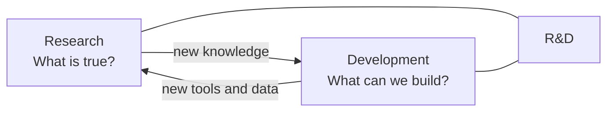

# Research vs Development

Both sides of R&D have their own questions, methods, and outputs. Mixing them up is the most common source of confusion when people start.

## Research — asking "what is true?"

Research is about asking questions and finding reliable answers.

Typical questions:

- Why does this disease happen?
- Which method works better?
- What data do we need?
- What pattern exists in this dataset?
- What has already been discovered?

Typical activities:

- Reading papers.
- Studying existing knowledge.
- Asking questions.
- Collecting data.
- Analyzing results.
- Drawing conclusions.

The output of research is **knowledge** — a finding, a number, a relationship, a paper, a piece of evidence that the world did not have before.

## Development — asking "what can we build?"

Development is about building something practical.

Typical things to build:

- A software tool.
- A data pipeline.
- A medical AI model.
- A clinical dashboard.
- A prototype device.
- A validated workflow.
- A new drug candidate.
- A new imaging biomarker.

Typical activities:

- Designing.
- Coding.
- Testing.
- Improving.
- Documenting.
- Deploying.
- Maintaining.

The output of development is **an artifact** — something a person can use, install, run, or hand to someone else.

## How they interact

Research feeds development by surfacing what is worth building. Development feeds research by producing the tools, datasets, and infrastructure that let you ask harder questions.

A project becomes **R&D** when this loop is intentional — when you build *because* you learned something, and you learn *because* you built something.

## A biomedical example

Take the question **"Does the hippocampus look different in patients with hippocampal sclerosis?"**

- **Research** answers: *yes — hippocampal volume is lower on the affected side, asymmetry index X separates patients from controls at AUC 0.87.*
- **Development** answers: *here is a Python tool that takes a T1 MRI, runs segmentation, computes the asymmetry index, and generates a one-page report.*
- **R&D** answers: *here is a validated, reproducible system that links the asymmetry biomarker to surgical outcomes across three hospitals, with the evidence in a paper and the workflow in an open-source tool.*

That third line is the version you grow toward across this hub.

## Where to next

- [R&D vs Research vs Development](comparison.md) — the comparison table.
- [Intermediate — the process](../intermediate/index.md) — the eight-step workflow that holds research and development together.
